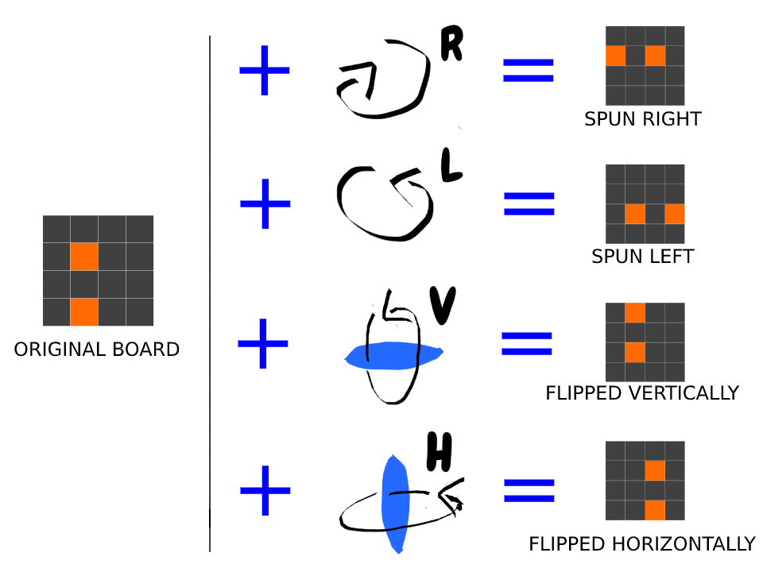
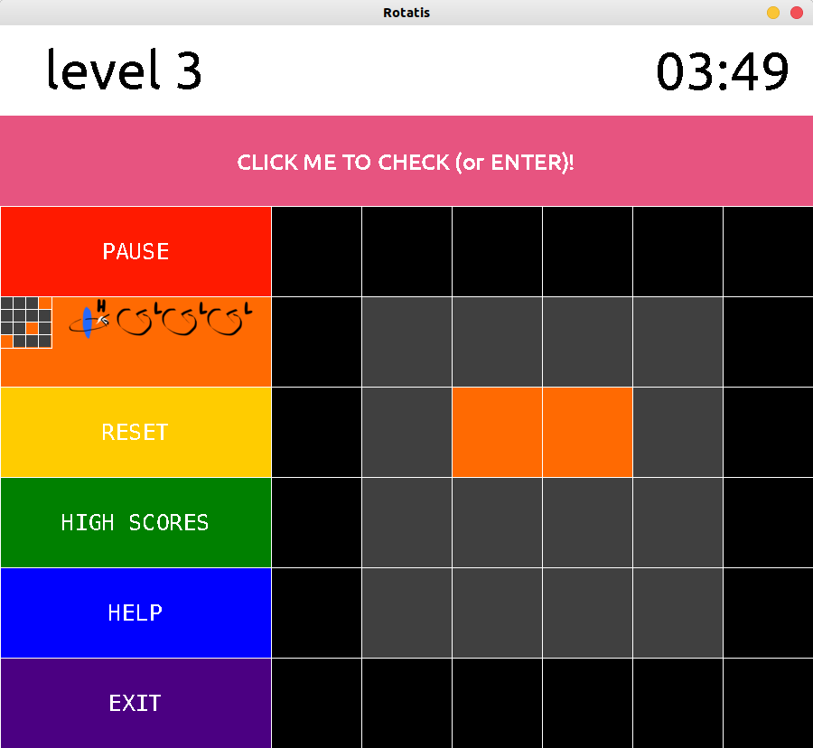
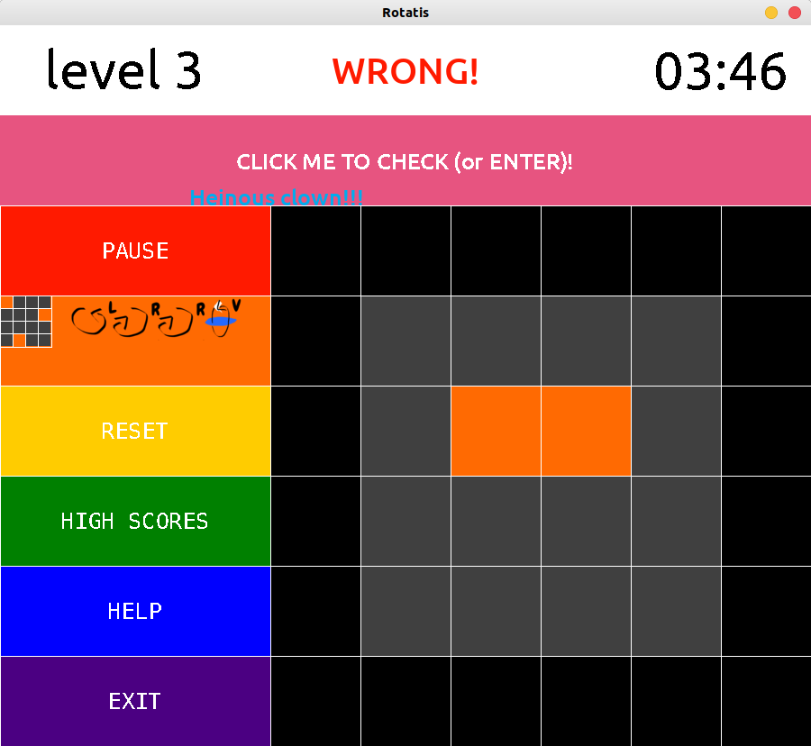

For recent MAC-OS users:
a pygame 2.0.0 (and above) version must be install, run:
> python3 -m pip install -U pygame==2.0.0.dev6 --user

---GAMEPLAY: YOU ARE ASKED TO CALCULATE THE SHAPE OF THE RANDOM BOARD AFTER THE COMPUTER RANDOMLY SPINNING OR FLIPPING IT. THERE ARE 5 LEVELS.

---HOW TO PLAY---

---GAME PHOTOS---

---WHEN YOU SUBMIT A WRONG GUESS, YOU GET A FREE **RANDOM INSULT** ---

